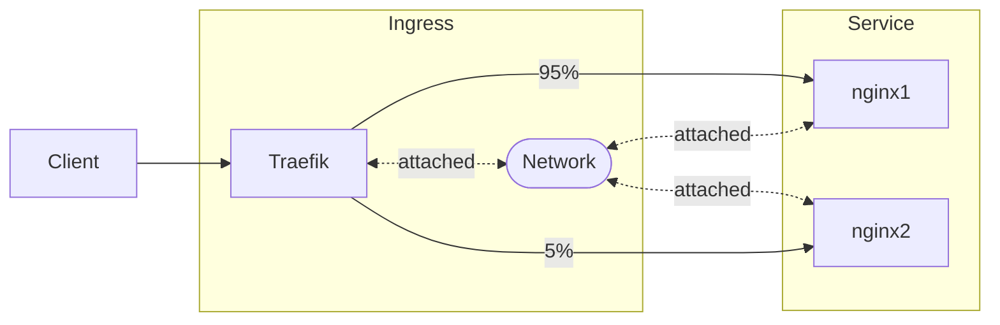

# Traefik Blue/Green Load Balancing Example

This repo is a proof-of-concept for using traefik to do blue/green deployments at a small scale with minimal config.

The switch-over (adjusting the weights) is still manual but no reason you couldn't automate it... perhaps easily via prom metrics:

https://doc.traefik.io/traefik/observability/metrics/prometheus/

## Setup

## Configs of Interest

- `./traefik/dynamic/traefik-dynamic.yml` - Where the action happens. Can be modified while traefik is running to adjust the volume of traffic to each instance without downtime. No need to restart traefik. Also defines the rule for 'production'.
- `./traefik/docker-compose.yml` - Points dynamic config (for hot reload) at the right directory.
- `./test-systems/docker-compose.yml` - Basic rules for access to individual services.